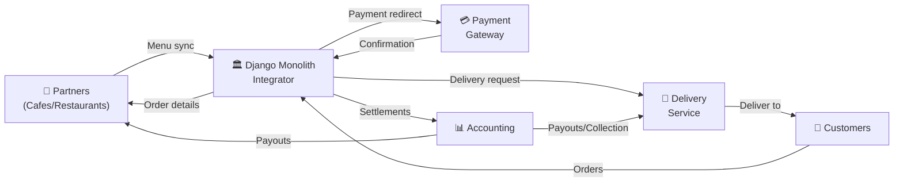
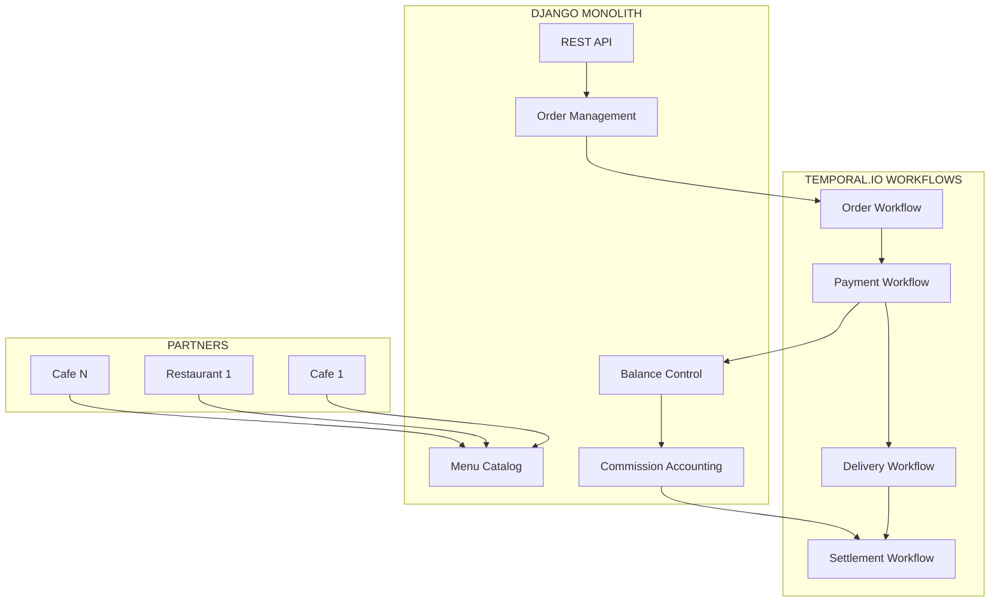
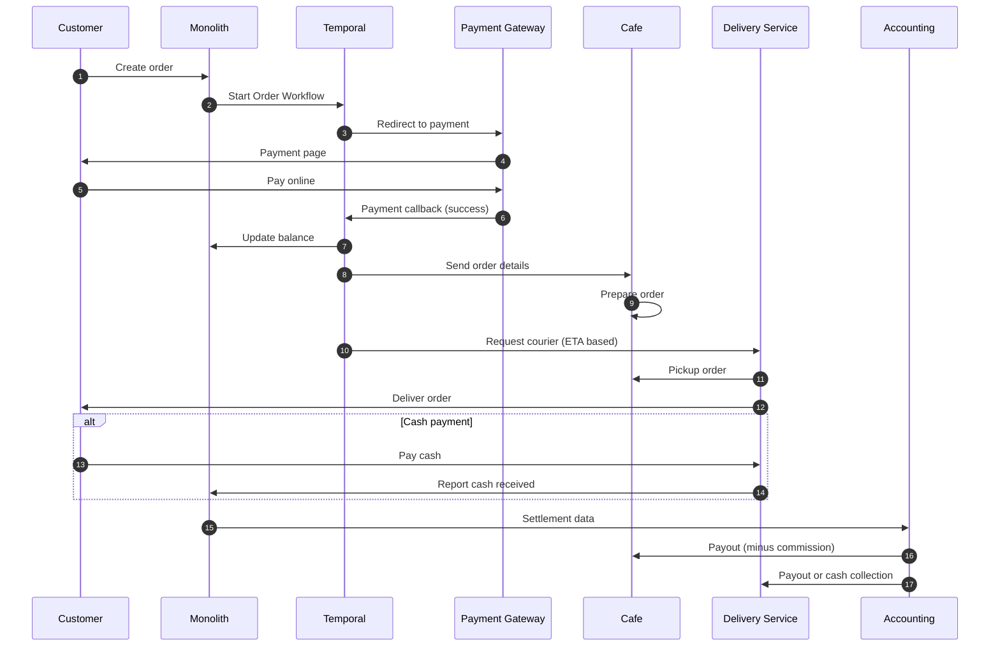
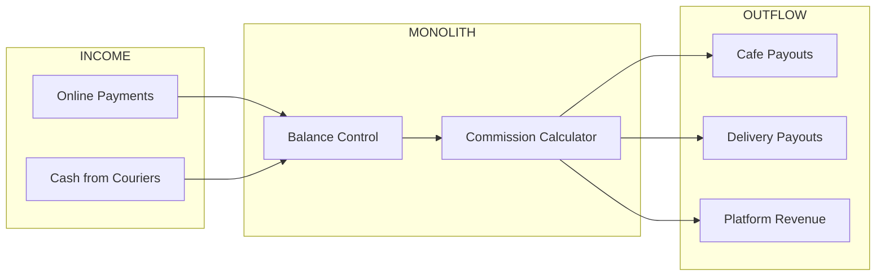
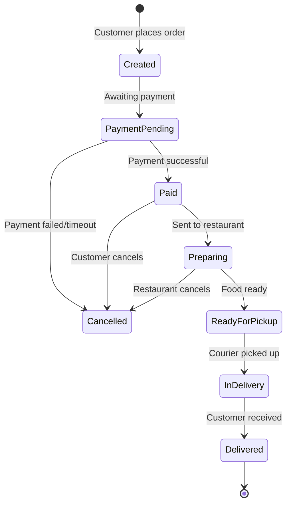
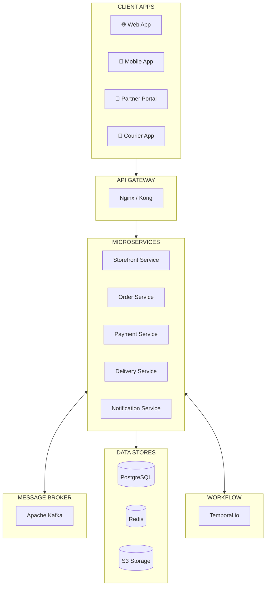
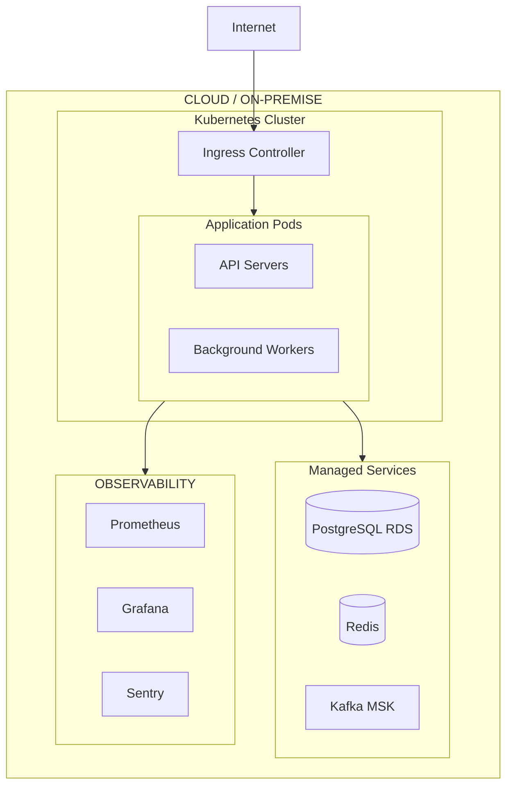
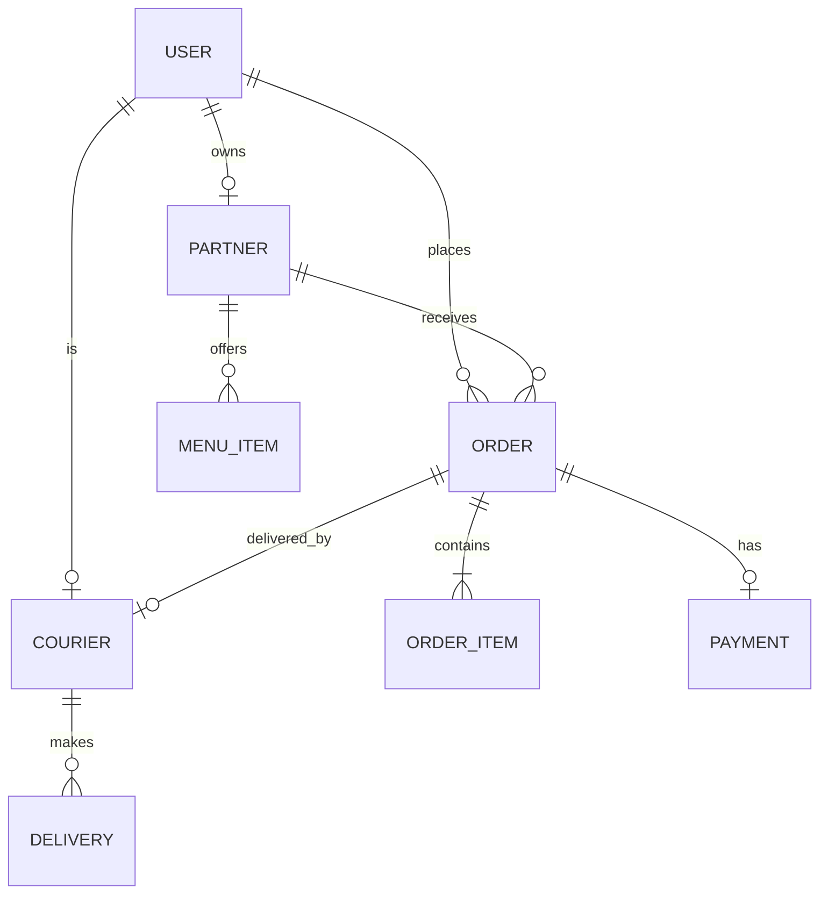

# Architecture Diagrams

Visual representation of the system architecture and flows.

---

## High-Level System Overview

---

## Detailed Component Architecture

---

## Order Flow Sequence

---

## Financial Flow

---

## Order State Machine

---

## Microservices Architecture (Target)

---

## Infrastructure Overview

---

## Database Schema (Simplified)

---

## Related Documentation

- [Project Overview](overview.md)
- [Tech Stack](tech-stack.md)
