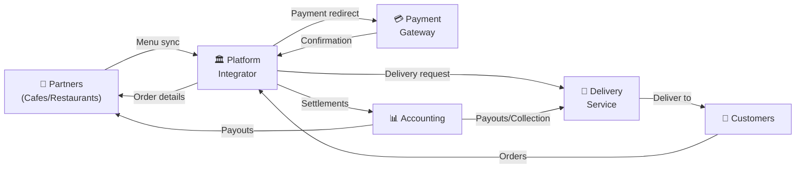

# Project Overview

## What We're Building

The project is the implementation of the business model of an **integrator of orders** for the delivery of ready meals from cafes and restaurants (which are independent external businesses) to customers.

The integrator handles:

- 🍕 **Order management** — from creation to delivery
- 💳 **Payments** — online and cash collection
- 🚚 **Delivery coordination** — courier dispatch and tracking
- 💰 **Commission accounting** — settlements with all parties
- 📱 **Notifications** — keeping everyone informed

---

## Business Model

---

## Business Flow

### 1. Menu Synchronization

Partners (cafes and restaurants) synchronize their available dishes through the integrator's API. Only items available for delivery are published to the catalog.

### 2. Order Creation

Customer selects dishes from the catalog and creates an order. The platform initiates a **Temporal.io Workflow** to manage the order through its entire lifecycle.

### 3. Payment Processing

- Customer is redirected to payment gateway (Mono/Stripe)
- Upon successful payment, the gateway sends a callback
- Funds are recorded in the integrator's balance

### 4. Order Handoff to Partner

After payment confirmation, the order is automatically transmitted to the corresponding cafe/restaurant for preparation.

### 5. Delivery Dispatch

Simultaneously, a courier is dispatched with arrival time calculated to match order readiness.

### 6. Delivery Execution

- Courier picks up the order and delivers to customer
- If online payment was not completed — courier collects cash payment

### 7. Financial Accounting

- Platform tracks all received funds (online + cash)
- Automatic commission calculation for all parties

### 8. Partner Settlements

Accounting department periodically processes:

- **Payouts to cafes/restaurants** — for completed orders minus integrator commission
- **Delivery service settlements** — payout for deliveries or collection of excess cash holdings

---

## Key Stakeholders

| Role | Description | Interactions |
|------|-------------|--------------|
| **Customer** | End user ordering food | Browse menu, place orders, track delivery, pay |
| **Partner** | Restaurant/Cafe owner | Manage menu, receive orders, prepare food |
| **Courier** | Delivery personnel | Accept deliveries, navigate, collect cash |
| **Admin** | Platform operator | Monitor operations, handle disputes, manage settings |

---

## Revenue Model

The platform generates revenue through:

1. **Commission per order** — percentage from each completed order
2. **Delivery fees** — charged to customers
3. **Premium listings** — featured restaurants (planned)
4. **Advertising** — in-app promotions (planned)

---

## Next Steps

- [View Architecture Diagrams](diagrams.md)
- [Explore Tech Stack](tech-stack.md)
- [Get Started](../guides/quickstart.md)
