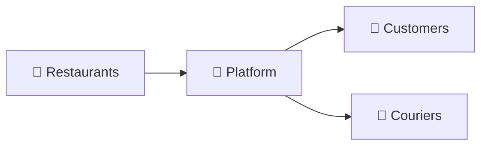

# Highly Loaded Distributed Service

Welcome to the documentation for the **Food Delivery Integrator Platform**.

---

## What is this project?

This is a highly loaded distributed service that acts as an **integrator** for food delivery — connecting restaurants, customers, and couriers in a single platform.

---

## Quick Links

-   :material-information-outline:{ .lg .middle } **About the Project**

    ---

    Learn about the business model, goals, and how the platform works

    [:octicons-arrow-right-24: Overview](about/overview.md)

-   :material-chart-box-outline:{ .lg .middle } **Architecture Diagrams**

    ---

    Visual diagrams of system architecture, order flow, and financial flow

    [:octicons-arrow-right-24: Diagrams](about/diagrams.md)

-   :material-tools:{ .lg .middle } **Tech Stack**

    ---

    Current and planned technologies used in the project

    [:octicons-arrow-right-24: Tech Stack](about/tech-stack.md)

-   :material-rocket-launch:{ .lg .middle } **Getting Started**

    ---

    Set up your development environment and run the project

    [:octicons-arrow-right-24: Quick Start](guides/quickstart.md)

---

## Key Features

| Feature | Description |
|---------|-------------|
| **Multi-tenant** | Support for multiple restaurants on single platform |
| **Real-time tracking** | Live order and courier tracking |
| **Multiple payment methods** | Online (Mono, Stripe) and cash payments |
| **Workflow orchestration** | Temporal.io for reliable order processing |
| **Microservices ready** | Designed for horizontal scaling |

---

## Project Status

| Component | Status     |
|-----------|------------|
| Documentation | ✅ Active   |
| Storefront Frontend | ✅ v0.1.0   |
| Storefront Backend | ✅ v0.2.0   |
| Order Service | 🚧 Planned |
| Payment Service | 🚧 Planned |
| Delivery Service | 🚧 Planned |

See [Changelog](changelog/index.md) for detailed version history.
