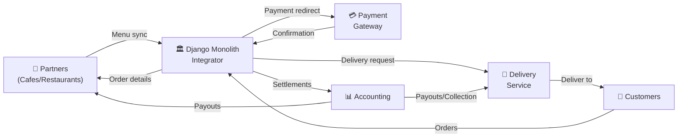
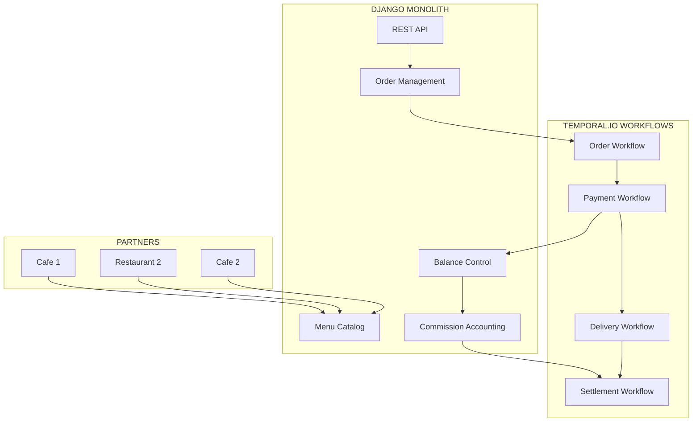
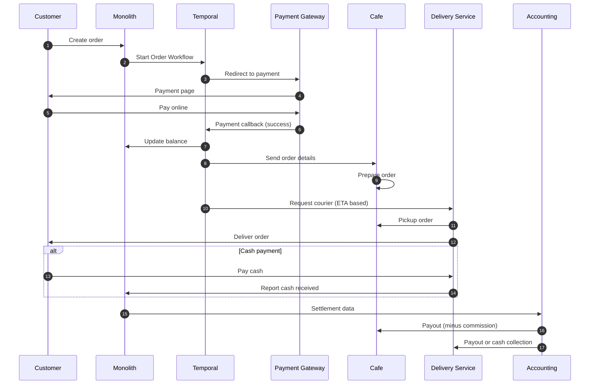
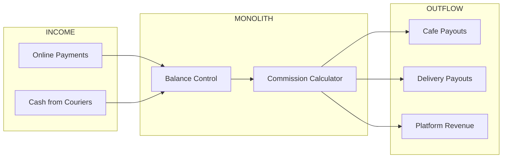

# Description of the project

## Overview
The project is the implementation of the business model of an integrator of orders for the delivery of
ready meals from cafes and restaurants,
which are independent external businesses, to customers.

Also, the integrator takes care of issues of delivery, payments, accounting of commissions,
notifications of all parties, transactions.

---

## Architecture Diagram

### High-Level System Overview

### Detailed Component Architecture

### Order Flow Sequence

### Financial Flow

---

## Business Flow Description

### 1. Menu Synchronization
Partners (cafes and restaurants) synchronize their available dishes through the integrator's API. Only items available for delivery are published to the catalog.

### 2. Order Creation
Customer selects dishes from the catalog and creates an order. The monolith initiates a **Temporal.io Workflow** to manage the order through its entire lifecycle.

### 3. Payment Processing
- Customer is redirected to payment gateway (Mono/Stripe)
- Upon successful payment, the gateway sends a callback
- Funds are recorded in the integrator's balance

### 4. Order Handoff to Partner
After payment confirmation, the order is automatically transmitted to the corresponding cafe/restaurant for preparation.

### 5. Delivery Dispatch
Simultaneously, a courier is dispatched with arrival time calculated to match order readiness.

### 6. Delivery Execution
- Courier picks up the order and delivers to customer
- If online payment was not completed — courier collects cash payment

### 7. Financial Accounting
- Monolith tracks all received funds (online + cash)
- Automatic commission calculation for all parties

### 8. Partner Settlements
Accounting department periodically processes:
- **Payouts to cafes/restaurants** — for completed orders minus integrator commission
- **Delivery service settlements** — payout for deliveries or collection of excess cash holdings

---

## Tech stack (actual)
- Project is fully dockerized
- MkDocs documentation service

## Tech stack (planned)
- Django - as a main monolith backend for 
- FastAPI
- PostgreSQL
- PostgreSQL + geo (for tracking)
- MongoDB
- Cockroach
- Cloudflare
- Kafka
- Temporalio
- S3
- React
- RabbitMQ
- Redis
- FastStream
- TaskIQ
- Celery
- Celerybeat
- Elastic
- Clickhouse
- gRPC
- sockets
- Flutter
- video streaming (?)
- prometheus
- grafana
- databasus (https://github.com/databasus/databasus)
- kanchi (https://github.com/getkanchi/kanchi)
- DjangoTenants
- SQLAlchemy
- Tortouse ORM
- pg_bouncer
- Kubernetes os Docker swarm
- SQLAdmin
- sentry
- nginx
- DRF
- django-ninja
- CI/CD
- testing
- MONO
- STRIPE
- multy currency
