# CockroachDB

CockroachDB is a distributed SQL database that survives node, rack, and datacenter failures with minimal latency disruption and no manual intervention. It speaks the PostgreSQL wire protocol — almost any Postgres driver "just works" — but underneath it's a globally-replicated, strongly-consistent, horizontally-scalable system.

In this project CockroachDB stores the **catalog (dishes)** — the largest, most read-heavy table — while PostgreSQL keeps everything else (users, auth, sessions, Celery beat). This document explains the *why* and the *how*.

---

## Table of Contents

1. [Theory](#theory)
2. [Internal Architecture: How CockroachDB Works Under the Hood](#internal-architecture-how-cockroachdb-works-under-the-hood)
3. [Real-World Deployment Example: Avito's DBaaS Platform](#real-world-deployment-example-avitos-dbaas-platform)
4. [Architecture](#architecture)
5. [Why a Second Database?](#why-a-second-database)
6. [Our Implementation](#our-implementation)
7. [The Database Router](#the-database-router)
8. [Migrations](#migrations)
9. [Schema Design Considerations](#schema-design-considerations)
10. [Insecure Mode and Authentication](#insecure-mode-and-authentication)
11. [Web UI and Operations](#web-ui-and-operations)
12. [Trade-offs and Caveats](#trade-offs-and-caveats)
13. [References](#references)

---

## Theory

### What CockroachDB Is

CockroachDB is built around three core ideas:

| Idea | What it means | What you get |
|------|---------------|--------------|
| **Distributed key-value store** | Data is split into 512 MB *ranges*, each range replicated 3× by default, placed on different nodes. | Survive node failure with zero downtime; storage scales by adding nodes. |
| **Raft consensus per range** | Every write must be acknowledged by a quorum (2 of 3 replicas). | Strong consistency: a successful write is durable on disk on multiple machines before the client sees `OK`. |
| **PostgreSQL wire protocol** | Same network protocol Postgres clients speak. | `psycopg`, `django-cockroachdb`, `pgcli`, DataGrip — all work as if it were Postgres. |

The result: a database that *looks* like a single PostgreSQL instance to your application, but is actually a geo-distributed cluster that can tolerate node loss without consistency or availability impact.

### Where CockroachDB Fits

| Workload | Postgres | CockroachDB |
|---|---|---|
| Single-region OLTP, ≤100 GB | ✅ Default choice | Overkill |
| OLTP that must survive datacenter failure | ❌ Manual replication, manual failover | ✅ Built-in |
| Multi-region, low-latency reads worldwide | ❌ Read replicas, complex | ✅ Follower reads, regional tables |
| Tables that grow into the TB range | ⚠️ Sharding required | ✅ Auto-rebalances |
| Strict SQL compatibility (extensions, stored procs) | ✅ Full Postgres | ⚠️ Subset — most things work, some don't |
| Single-node analytics (`OLAP`, big aggregations) | ✅ Better single-node perf | ❌ Use ClickHouse |

The honest summary: CockroachDB trades raw single-node throughput for survivability and elastic scaling. Picking it for a 10 GB table on one machine is the wrong call. Picking it for a catalog that you expect to grow horizontally and that *must* keep serving reads even when a node dies is the right call.

### How a Write Becomes Durable

```
┌───────────────────────────────────────────────────────────────────┐
│                     INSERT INTO catalog.dish ...                  │
└───────────────────────────────────────────────────────────────────┘
                              │
                              ▼
┌───────────────────────────────────────────────────────────────────┐
│  1. SQL gateway (any node) parses the statement and finds the     │
│     range that owns the row's primary key.                        │
└───────────────────────────────────────────────────────────────────┘
                              │
                              ▼
┌───────────────────────────────────────────────────────────────────┐
│  2. The lease holder for that range proposes the write to its     │
│     2 other replicas via Raft.                                    │
│                                                                   │
│     Replica A (leader)  ──┐                                       │
│     Replica B (follower) ─┼─► Raft log entry, fsync to disk       │
│     Replica C (follower) ─┘                                       │
└───────────────────────────────────────────────────────────────────┘
                              │
                              ▼
┌───────────────────────────────────────────────────────────────────┐
│  3. Once 2 of 3 replicas have durably persisted the entry, the    │
│     leader commits and acks the client.                           │
│                                                                   │
│     Client sees:  INSERT 0 1                                      │
└───────────────────────────────────────────────────────────────────┘
```

Two-of-three quorum is the *minimum* — even if one node dies between steps 2 and 3, the write either committed (and is on the surviving 2) or didn't (and is on at most 1, which the new leader will reconcile). There is no "lost write" window.

---

## Internal Architecture: How CockroachDB Works Under the Hood

The "three nodes, Raft, ranges" picture from the previous section is the surface. To reason about performance, failure modes, and topology choices, you need to understand how data is split, where the metadata lives, how a query physically travels through the cluster, and what tricks Cockroach uses to keep latency from exploding. This section walks through that machinery — much of it is informed by how Avito DBA team operates CockroachDB on their internal DBaaS platform, where the same primitives are exposed to product teams at scale.

### Ranges: How Data Is Physically Split

A Cockroach cluster does not store "tables" as a unit. The whole keyspace — every row of every table, every secondary index entry, even the system metadata — is a single sorted key-value space, chopped into contiguous chunks called **ranges** (by default ~512 MB each). A monolithic table with one primary-key column is split into ranges along key boundaries; as the table grows, ranges split; as ranges become hot, they split too.

```
┌─────────────────────────────────────────────────────────────┐
│  Table: catalog_dish (logically one table)                  │
├─────────────────────────────────────────────────────────────┤
│  Range A: keys [00000000…, 3FFFFFFF…)                       │
│  Range B: keys [3FFFFFFF…, 7FFFFFFF…)                       │
│  Range C: keys [7FFFFFFF…, BFFFFFFF…)                       │
│  Range D: keys [BFFFFFFF…, FFFFFFFF…]                       │
└─────────────────────────────────────────────────────────────┘
```

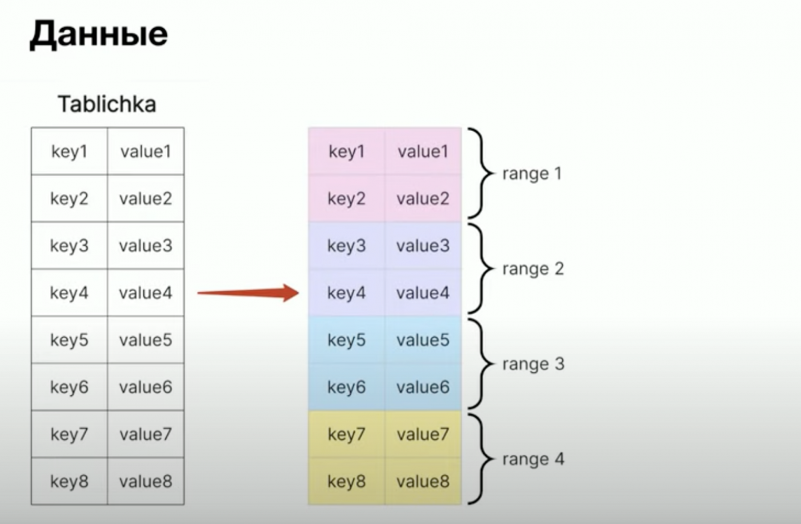
*A monolithic table sliced into contiguous ranges along the primary-key space.*

### Replication and the Replication Factor

Each range is copied N times, where N is the **replication factor** (minimum 3, default 3 — i.e. one leader and two followers). Replicas are spread across nodes (and, when configured, across datacenters) according to **locality** rules.

```
  Range A         Range B         Range C
  ┌──────┐        ┌──────┐        ┌──────┐
  │ N1 ★ │        │ N2 ★ │        │ N3 ★ │   ★ = leaseholder / leader
  │ N2   │        │ N3   │        │ N1   │
  │ N3   │        │ N1   │        │ N2   │
  └──────┘        └──────┘        └──────┘
```

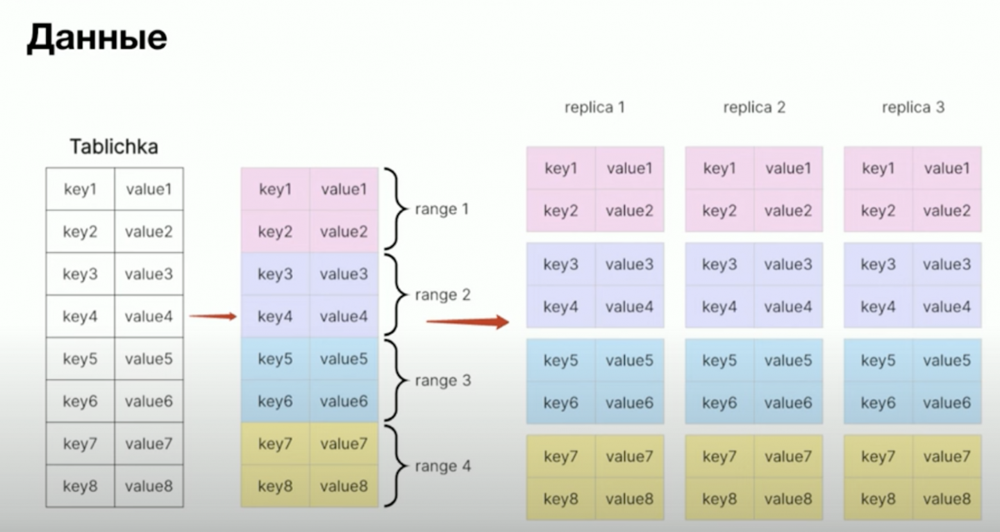
*Each range is copied N times across nodes; here N=3 (one leader, two followers).*

Increasing the replication factor (e.g. from 3 to 5) buys you survivability — a 5-replica range tolerates loss of 2 replicas instead of 1 — at the cost of more disk used and more raft traffic per write. It's a deliberate tuning lever, not a free upgrade.

### Leaseholders vs. Raft Leaders

Two roles exist per range, and they are not the same thing — though Cockroach actively tries to co-locate them on the same node:

| Role | Responsibility |
|------|----------------|
| **Leaseholder** | Serves all reads and writes for the range; enforces transactional isolation; the SQL layer's entry point for that range. |
| **Raft leader** | Drives the Raft consensus protocol — proposes log entries, collects acknowledgements from a quorum of replicas, commits writes to the Raft log. |

The **leaseholder node** is the node currently holding the lease on a given range. When a request lands on any node, that node forwards it to the leaseholder of the affected range; the leaseholder then asks the Raft leader to replicate the write to a quorum, waits for the ack, and returns the result.

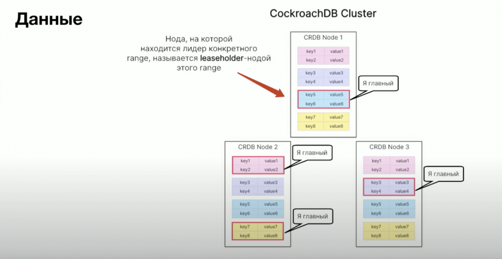
*The leaseholder for each range — the node that owns the lease for transactional access — may live on any node in the cluster.*

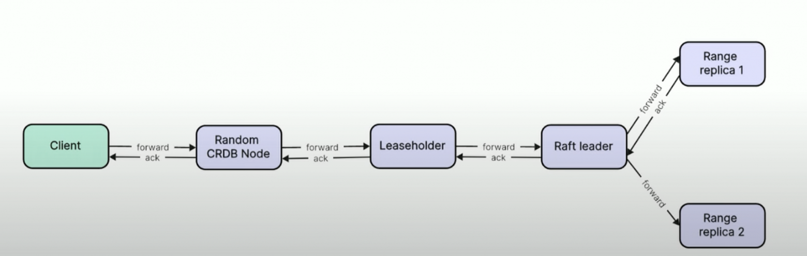
*The leaseholder governs transactional access; the Raft leader drives consensus and log replication. Cockroach co-locates them whenever possible.*

Why split the roles at all? Because they're conceptually different: the leaseholder is about *transactions and isolation*, the Raft leader is about *durability and replication*. Cockroach keeps them on the same node whenever possible to avoid an extra hop on every write — but the cluster will tolerate them being on different nodes during rebalancing or failure recovery.

The inherent cost of this design: every write needs majority acknowledgement (e.g. 2 of 3 fsyncs). That's the source of Cockroach's "distributed transactions are not free" tax — typically a few extra milliseconds per write compared to a single-node Postgres.

### Locating a Range: meta1, meta2, and meta0

Given a key, how does the cluster know which node holds the leaseholder for the range that owns that key? The answer is a two-level distributed index, baked into the system keyspace:

- **meta1** — a top-level "range of ranges." Maps key prefixes to the meta2 range that knows about them.
- **meta2** — maps each key range to the node currently holding the leaseholder for it.
- **meta0** — a tiny well-known pointer that tells every node where the meta1 leaseholder lives. Always in memory, always available locally on every node.

```
  client query for key K
        │
        ▼
  Node receiving the query
        │
        │  (1) Where is meta1?  →  meta0 (always known locally)
        │  (2) Read meta1       →  "meta2 for K's prefix lives on Node X"
        │  (3) Read meta2 on X  →  "leaseholder for K's range is Node Y"
        │  (4) Forward to Y     →  Y reads/writes K and returns the result
        ▼
  Result returned to client
```

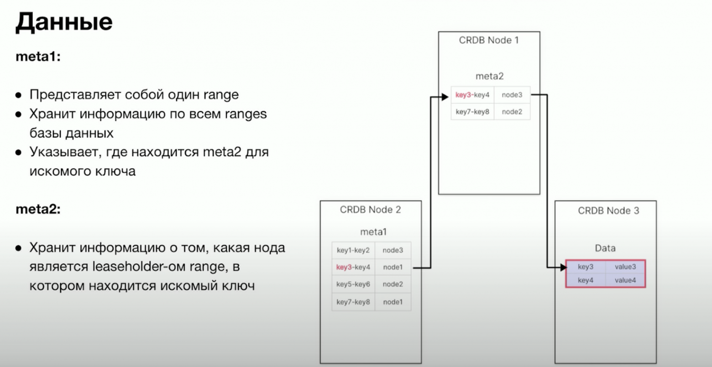
*meta1 → meta2 → leaseholder. Three lookups in the worst case before any user data is touched.*

In the worst case, that's three network hops before the data is even touched. In practice, this almost never happens — see caching below.

### How a Query Physically Executes

Put the pieces together. A client opens a connection to whichever Cockroach node is reachable — call it Node 2 — and runs `SELECT * FROM catalog_dish WHERE id = $1`.

1. Node 2 parses the SQL and extracts the primary key. It needs to find the leaseholder for the range that owns this key.
2. Node 2 consults its meta cache. On a cold cache (first query, or the cache entry has been evicted), it walks meta1 → meta2; on a warm cache, it skips straight to the known leaseholder.
3. Node 2 forwards the request to the leaseholder — say, Node 3.
4. Node 3 (as leaseholder) executes the read. For a write, it would propose the change to the Raft leader, wait for quorum acknowledgement, then commit.
5. The result returns to Node 2, which returns it to the client.

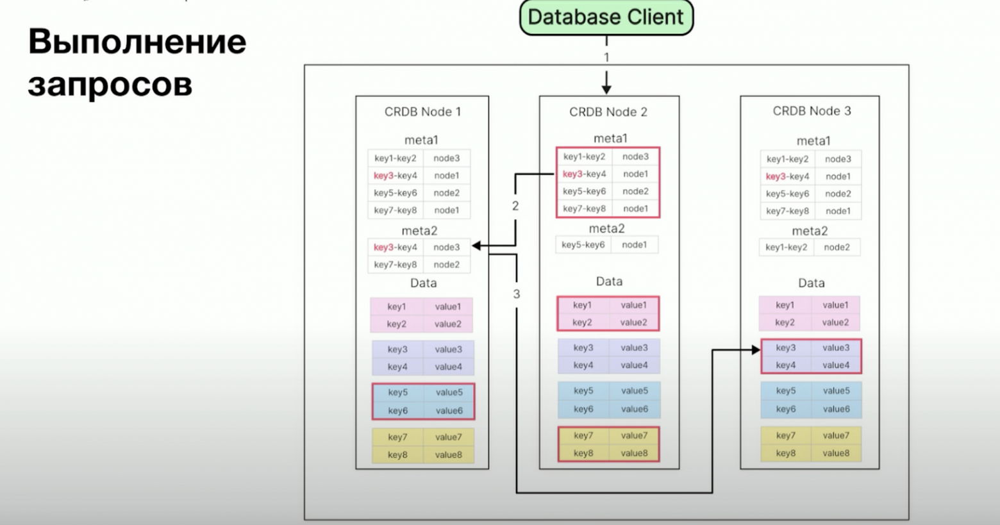
*Worst-case query routing: client hits Node 2, which reads meta1 on Node 1, then meta2 to find the leaseholder on Node 3, where the read finally executes.*

The diagram above is the worst case — every metadata lookup hits a different node. Real clusters very rarely look like this for steady-state traffic, because of caching.

### Caching: Why Most Queries Skip the Two-Level Walk

Cockroach aggressively caches range location data on every node:

1. **Range descriptor cache.** After looking up where a key lives, the node remembers it. Next query for the same key range goes straight to the leaseholder — no meta1, no meta2.
2. **meta2 location cache.** If the range descriptor for the specific key isn't cached, the node may still know which meta2 range covers that key prefix, skipping the meta1 step.
3. **meta1 leaseholder is known via meta0.** Every node can locate meta1 instantly without any network round trip.

A cold cache in production is typically only seen at startup, after a major topology change, or after eviction under memory pressure. For warm steady-state traffic, the lookup path collapses to a single hop: cached descriptor → leaseholder. This is what makes Cockroach's geo-distributed design viable — the *worst case* is three hops, the *common case* is one.

### Topology and Datacenter Survival

Replication factor and node count interact with locality to determine *what kinds of failure the cluster can survive*. The key constraint: to keep a range available, a strict majority of its replicas must be reachable.

**3 nodes, RF=3, one node per DC.**
Each range has one replica per DC. Loss of any single node — or any single DC — leaves 2 of 3 replicas available, so every range stays writable. This is the default sweet spot for a small cluster.

```
  DC1: Node1   DC2: Node2   DC3: Node3
   [replica]    [replica]    [replica]    ← one range, three replicas, one per DC
```

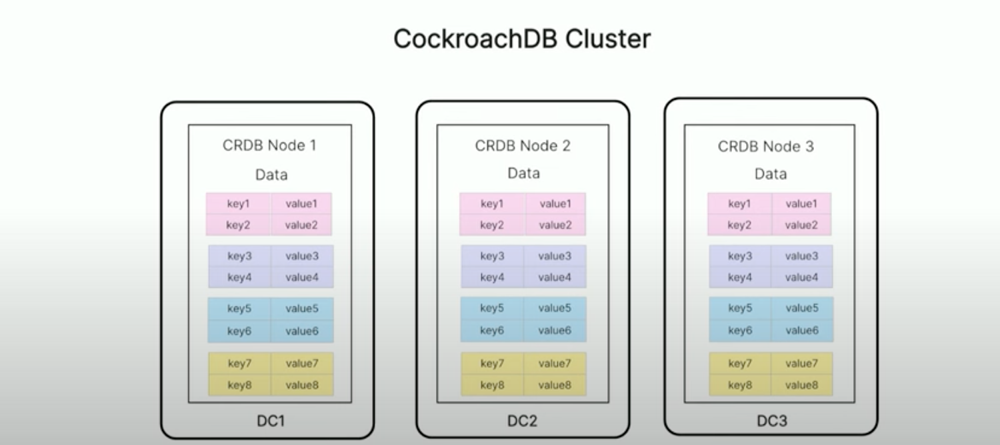
*Each range has exactly one replica in each DC. Loss of any single node or any single DC leaves a quorum.*

**6 nodes, RF=3, no locality hints.**
More capacity, but Cockroach now has freedom to place all three replicas of a range inside the same DC. Losing 2 nodes — or one DC that happens to hold the majority of some range's replicas — takes part of the data offline.

```
  DC1: N1 N2   DC2: N3 N4   DC3: N5 N6
  range X replicas: [N1, N2, N3]   ← 2 in DC1
  if DC1 dies, range X loses majority → unavailable
```

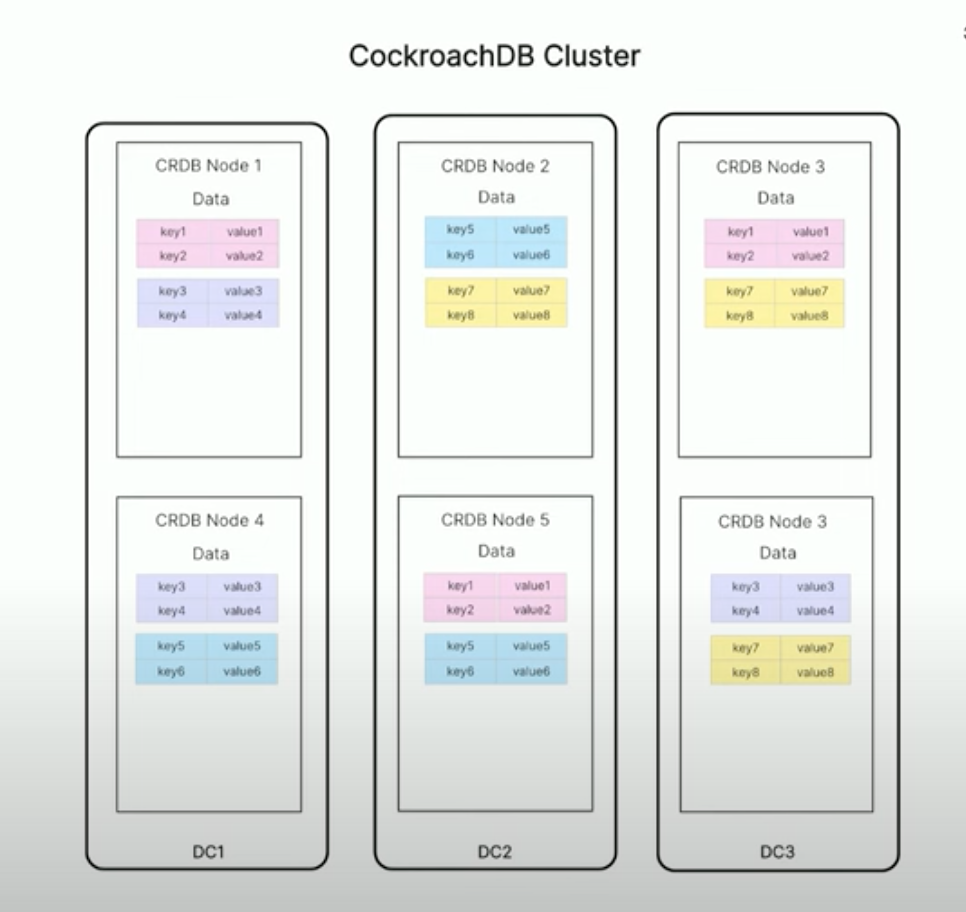
*With no locality hints, Cockroach is free to put all three replicas of a range inside the same DC.*

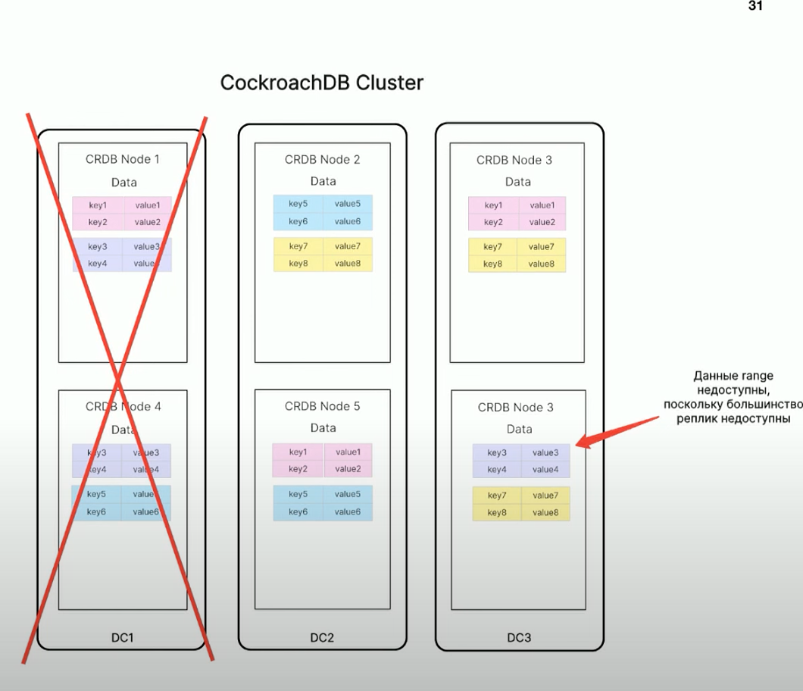
*When DC1 dies, two of three replicas of the purple range vanish — majority lost — so the data becomes unavailable.*

**6 nodes, RF=5, no locality.**
Increasing replication factor to 5 means a range survives loss of 2 replicas. Now the cluster tolerates any 2 nodes failing — including a whole DC — but every write has to reach 3 of 5 replicas, increasing tail latency and disk usage.

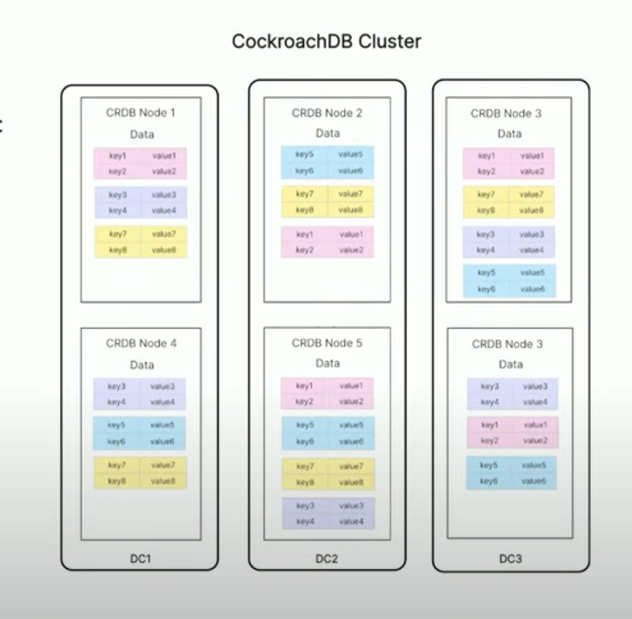
*RF=5 tolerates loss of any 2 replicas — including a whole DC — at the cost of more disk and more raft traffic per write.*

**6 nodes, RF=3, with `--locality region=…,zone=<dc>`.**
When Cockroach knows the DC of each node, it places one replica of each range in each DC, respecting the locality constraint. Now a whole DC can fail and every range still has 2 of 3 replicas online — without paying the RF=5 cost.

```
  DC1: N1 N2   DC2: N3 N4   DC3: N5 N6
  range X replicas: [N1, N3, N5]   ← exactly one per DC
  range Y replicas: [N2, N4, N6]   ← same pattern
  any DC can die → every range still has majority
```

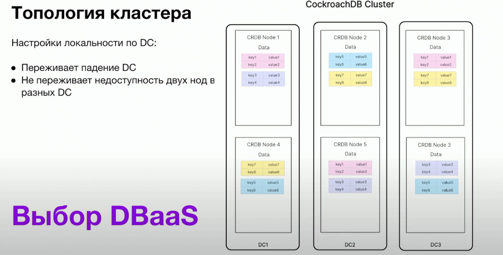
*With `--locality region=...,zone=<dc>`, Cockroach guarantees one replica per DC. A whole-DC failure leaves a 2-of-3 quorum for every range — without paying the RF=5 cost.*

This is why the locality flag matters: it's the cheapest way to get DC-failure tolerance once you scale beyond three nodes.

### Key Health Metrics

A few cluster-wide metrics directly reflect the internals above and are worth alerting on:

| Metric | What it means | Why it matters |
|--------|---------------|----------------|
| **Unavailable ranges** | More than half the replicas of a range are down. | Reads/writes for that range will hang. Immediate intervention needed to avoid data loss. |
| **Under-replicated ranges** | A range has fewer live replicas than the replication factor. | Cockroach is trying to re-replicate but hasn't caught up — durability is degraded. |
| **Node availability** | Nodes responding to heartbeats. | Network partitions, hardware failures, OOM kills all show up here first. |
| **Clock skew between nodes** | NTP / PTP drift across the cluster. | Cockroach's transaction ordering depends on bounded clock skew. If skew exceeds the configured maximum, the affected node is shut out of the cluster to preserve serializability — visible as sudden cluster-wide unavailability. |

All of these are surfaced in the admin UI on port 8080 (see [Web UI and Operations](#web-ui-and-operations)) and can be scraped via the Prometheus endpoint.

---

## Real-World Deployment Example: Avito's DBaaS Platform

The Avito DBA team published a detailed account of how they integrated CockroachDB into their internal **DBaaS (Database-as-a-Service)** platform alongside the rest of their database zoo (Postgres, MongoDB, Redis, ClickHouse, Elasticsearch, Ceph, Kafka). It's a useful concrete example because it shows the gap between "running three Cockroach nodes in Docker on a laptop" and "running CockroachDB as a self-service product for hundreds of internal teams." This section summarises that deployment.

**Sources:**
- Article: [«Как мы внедрили CockroachDB на DBaaS в компанию классических СУБД»](https://avito.tech/content/5gnlso8ih1-kak-mi-vnedrili-cockroachdb-na-dbaas-v-k) by Polina Kudryavtseva, Avito DBA engineer.
- Talk recording: [«НЕмитап Database#1 — CockroachDB на платформе DBaaS»](https://www.youtube.com/watch?v=lF5kB7p6nQY) on YouTube.

### Why They Chose CockroachDB

Avito's DBaaS already supported Postgres well, but Postgres alone couldn't meet a specific class of requirements: services that needed **99.99% availability**, had to absorb traffic spikes of up to 10x, and had to scale horizontally across datacenters with minimal operational effort.

The selection criteria were concrete:

- automatic horizontal scaling without sharding middleware,
- fault tolerance up to whole-DC loss,
- cross-region replication out of the box,
- ACID transactions with strong isolation,
- PostgreSQL wire-protocol compatibility (so existing Go services could connect with minimal change),
- a mature Go client (Avito's primary language).

CockroachDB met all of these; the key technical bets they were buying into were **Serializable isolation by default**, **online schema changes** (no maintenance windows for `ALTER TABLE`), **MVCC with garbage collection that physically reclaims disk**, and **native Kubernetes integration**.

### Cluster Topology in DBaaS

The default CockroachDB cluster on Avito's DBaaS platform is **3 nodes, one per datacenter, RF=3**. This is the same baseline pattern described in [Topology and Datacenter Survival](#topology-and-datacenter-survival) above — chosen for the same reason: it's the cheapest configuration that survives both single-node and single-DC failure.

When a customer service needs more capacity, the cluster scales out. The interesting part of the Avito write-up is what they explicitly *don't* do: they don't just "add more nodes" naively. They confirmed in production what the topology section above predicts — a 6-node, RF=3 cluster *without* locality hints can lose data on a DC failure, because Cockroach is free to place all three replicas of some range in the same DC. The fix they settled on is `--locality region=msk,zone=<datacenter>`, which forces Cockroach to spread replicas one-per-DC even at higher node counts. They consciously rejected the alternative — raising RF to 5 — because of the extra disk and write-latency cost.

The outcome: both the 3-node and the scaled-out 6-node configurations on the platform tolerate the loss of a whole datacenter without losing availability or data.

### How a Database Is Provisioned

This is the part that turns CockroachDB from "a database you operate" into "a self-service product." Avito built a small Kubernetes-native control plane:

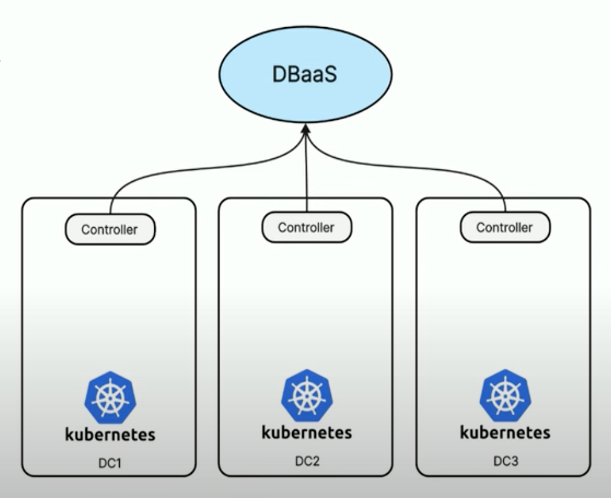
*Each datacenter has an independent Kubernetes cluster running a controller that polls the DBaaS metadata API for new database requests.*

The flow when a developer requests a new CockroachDB cluster:

1. Developer files a request via the DBaaS UI/API; metadata for the new database appears in DBaaS.
2. In each datacenter, an autonomous controller (running inside that DC's k8s cluster) polls DBaaS for new database metadata.
3. When the controller sees a new entry, it generates Kubernetes manifests for its slice of the cluster — one Cockroach node — and applies them to the local k8s.
4. The three nodes (one per DC) come up, discover each other, form a cluster.

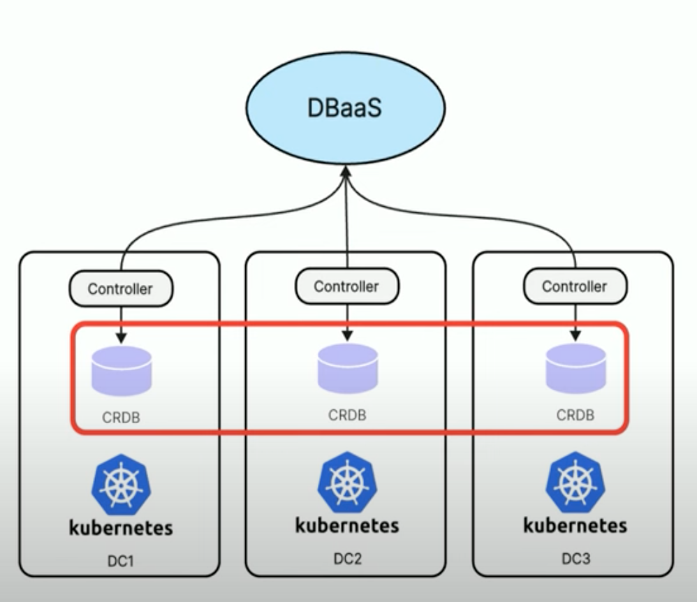
*The result: a single logical CockroachDB cluster with one node in each of three independent Kubernetes clusters, one per datacenter.*

Note what this design avoids: there is no central Kubernetes federation, no cross-DC k8s control plane. Each DC's k8s cluster is autonomous; the only thing they share is the DBaaS metadata service, which acts as the source of truth for "which databases should exist." If one DC's k8s control plane goes down, the other two DCs' nodes keep running and the cluster keeps serving traffic — it just can't be reconfigured until the failed DC is back.

### The Sidecar Agent

A CockroachDB cluster on the platform isn't just three raw `cockroach start` processes. Next to each Cockroach node, the DBaaS deploys a **sidecar agent container** that handles everything a DBA would otherwise do by hand:

- **Role and user management** — creates service accounts and personal accounts at the right access levels.
- **Database creation** — spins up the actual database with the platform's standard configuration (timeouts, GC settings, etc.).
- **Backups** — schedules and runs regular backups automatically, no manual cron.
- **Health checks** — emits heartbeats so the platform's monitoring knows which nodes are alive.

This sidecar pattern is worth flagging because it's the operational glue that makes self-service work. Without it, every new database would need a human DBA to run `CREATE USER`, `GRANT`, set up `BACKUP TO ...` schedules, hook up alerts — multiplied by every team that asks for a database.

### Role Model

Avito's DBaaS uses a layered Postgres/Cockroach role model with two concepts:

- A **role** is a SQL user with `LOGIN` — either a human (admin, developer) or a service account.
- A **group** is a SQL role with `NOLOGIN` — a permission bucket. Roles inherit privileges by being granted membership in a group.

Three platform-defined groups cover the access patterns:

| Group | Permissions | Typical user |
|-------|-------------|--------------|
| **Full Access (FA)** | DML + DDL — can create/alter objects and read/write data | Schema migrations, deploy pipelines |
| **Read Write (RW)** | DML only — can read and write data, use sequences, but cannot change schema | Production application code |
| **Read Only (RO)** | Read-only — `SELECT` and read sequence values | Analytics, dashboards, support tools |

For service accounts there are two purpose-built role pairs:

- **Deploy user** (in group FA): used by CI/CD to apply migrations. Has DDL rights.
- **Production user** (in group RW): used by the running service. Cannot accidentally `DROP TABLE` even if the application is compromised.

Each pair comes in **two copies** (e.g. `deploy_01` and `deploy_02`) for password rotation. While a password is being rotated on `deploy_01`, the service is switched to `deploy_02`; once `deploy_01` is updated, the service can switch back. This is the same dual-credential pattern that makes secret rotation possible without downtime.

The principle worth carrying away: **separate the roles your CI uses to deploy schema from the roles your application uses to serve traffic.** A compromised production credential should not be able to drop tables.

### Day-2 Operations

Beyond provisioning, the Avito team operates the platform with:

- **A first-party `crdb` Go library** for application use — wraps connection management, retries, and the conventions the platform expects.
- **A migrations framework** for schema changes against Cockroach.
- **Sampling and metrics collection** to feed dashboards and alerts.
- **Scheduled backups**, executed by the sidecar agent.
- **24/7 alerting** on the health metrics described above (unavailable ranges, under-replicated ranges, node availability, clock skew between nodes).

The alert on **clock skew** deserves emphasis: Cockroach's transaction ordering depends on bounded clock skew between nodes. If skew exceeds the configured maximum, Cockroach cannot tell which transaction happened first — so to preserve serializability, it shuts the affected node out of the cluster. In a multi-DC deployment with NTP drift, this can manifest as sudden cluster-wide unavailability that *looks* like a network problem but is actually a time problem.

### What's on the Roadmap

The Avito team is building a CDC pipeline from CockroachDB into their data warehouse. The ingredients:

- **CockroachDB changefeeds** — native streaming of DML events (INSERT/UPDATE/DELETE) from any table to an external sink.
- **Schema diffing** for DDL events — changefeeds don't capture schema changes, so they detect those by comparing the current schema to a last-known snapshot.
- **Kafka** as the transport, with events serialised in a CDC format.

This is a pattern worth knowing about: changefeeds give you DML-level change data capture as a built-in feature, but you have to assemble DDL tracking yourself.

### Lessons Worth Taking Away

A few things from the Avito deployment that generalise beyond their specific platform:

1. **CockroachDB doesn't replace your other databases.** The Avito team is explicit about this: they still run Postgres, MongoDB, Redis, ClickHouse, Elasticsearch, and Kafka. Cockroach earned a place in the zoo specifically for workloads that need horizontal scale + DC-failure survival. Picking it for a 1 GB lookup table would be the wrong call.
2. **Locality is not optional past 3 nodes.** The naive 6-node RF=3 cluster *will* lose data on a DC failure. `--locality` is the cheap fix; raising RF to 5 is the expensive one.
3. **Self-service requires a sidecar.** The agent-per-node pattern is what turns "three Cockroach processes" into "a database product." The same idea applies to any database you want to expose as a self-service primitive.
4. **Two roles per service, dual credentials per role.** Deploy/production split protects against accidental DDL from the running app. Dual credentials enable zero-downtime password rotation.
5. **Alert on clock skew.** It's a class of failure that looks like a network problem and isn't. Cockroach will fence off a drifting node to preserve correctness, and you want to know about it before users do.

The pieces of this deployment that map onto the local prototype in the rest of this document: Avito's 3-nodes-one-per-DC default is exactly the topology of `roach1`/`roach2`/`roach3` here — just spread across real datacenters instead of one Docker network. Their sidecar agent corresponds to the `roach-init` container we use to bootstrap users and the database (a much smaller version of the same idea). What this prototype deliberately omits — the controller-per-DC, the multi-tenant DBaaS API, the role-rotation tooling, the changefeed pipeline — is what production-grade self-service requires.

---

## Architecture

### Cluster Layout in This Project

Three nodes, all peers (no dedicated controller node like Kafka has). Each node runs the full Cockroach binary and serves both as a **storage replica** and as a **SQL gateway**.

```
┌──────────────────────────────────────────────────────────────────┐
│                     Docker network: app-network                  │
│                                                                  │
│  ┌────────────┐    ┌────────────┐    ┌────────────┐              │
│  │  roach1    │◄──►│  roach2    │◄──►│  roach3    │              │
│  │            │    │            │    │            │              │
│  │  SQL :26257│    │  SQL :26257│    │  SQL :26257│              │
│  │  HTTP:8080 │    │  HTTP:8080 │    │  HTTP:8080 │              │
│  └─────┬──────┘    └────────────┘    └────────────┘              │
│        │                                                         │
│        │ exposed to host as :26257 and :8088                     │
│        │                                                         │
└────────┼─────────────────────────────────────────────────────────┘
         │
         ▼
   ┌──────────────────────────┐
   │  Django app              │
   │  (storefront_catalog…)   │
   │                          │
   │  Connects only to roach1 │
   └──────────────────────────┘
```

**Why expose only roach1?** For local development, a single SQL gateway is enough — Cockroach internally routes the query to the range leader regardless of which node received it. In production you'd put a TCP load balancer (HAProxy, an L4 service mesh, AWS NLB) in front of all three so client connections are spread evenly and a node death is invisible to the client.

### The `roach-init` Bootstrap

A fresh Cockroach cluster needs **two** initialization steps before it can serve traffic:

1. `cockroach init` — converts the three running-but-uninitialized nodes into a cluster (decides on cluster ID, bootstraps the system ranges).
2. Application-level setup — create the database, the application user, grant permissions.

We do both in a one-shot init container:

```yaml
roach-init:
  image: cockroachdb/cockroach:v24.2.0
  depends_on: [roach1, roach2, roach3]
  restart: "no"
  entrypoint: ["/bin/sh", "-c"]
  command: |
    "
    sleep 8 &&
    cockroach init --insecure --host=roach1 || true &&
    cockroach sql --insecure --host=roach1 --user=root -e \"
      CREATE DATABASE IF NOT EXISTS catalog;
      CREATE USER IF NOT EXISTS django;
      GRANT ALL ON DATABASE catalog TO django;
    \"
    "
```

A few subtleties worth understanding:

- `|| true` after `cockroach init` swallows the "cluster already initialized" error on subsequent runs. The init step is idempotent in spirit but not in exit code.
- `--user=root` is required even on insecure clusters: the SQL shell otherwise reads `COCKROACH_USER` from the environment and tries to connect as that user, which then fails on DDL like `CREATE USER`.
- `restart: "no"` means the container runs once and stops. **Important:** if you change this `command:`, you must `docker compose rm -sf roach-init` before `docker compose up -d roach-init` will pick it up — compose otherwise reuses the existing exited container as-is.

### Persistent Storage

The data is bind-mounted into the project's `data/` directory:

```yaml
roach1:
  volumes:
    - ./data/roach1:/cockroach/cockroach-data
roach2:
  volumes:
    - ./data/roach2:/cockroach/cockroach-data
roach3:
  volumes:
    - ./data/roach3:/cockroach/cockroach-data
```

This is convenient locally — `du -sh data/roach1` shows real disk usage, `tar czf` is a backup, `rm -rf data/roach{1,2,3}` is a clean reset. On macOS this is slightly slower than named volumes (the Docker Desktop file proxy adds overhead), but for development that's invisible.

---

## Why a Second Database?

The project deliberately splits storage between Postgres and CockroachDB:

| Data | Database | Reason |
|------|----------|--------|
| `auth_user`, `sessions`, `admin_log`, `django_celery_beat` | Postgres | Small, transactional, joined heavily with each other, written rarely. |
| `catalog.dish` | CockroachDB | Largest table, dominant read traffic, expected to grow horizontally as more restaurants onboard. |

This is not "multi-database for the sake of it." It's a learning prototype showing what a real production split might look like:

- **Reference / configuration data** stays on a single conventional Postgres instance, where it's cheap and the operational tooling (pg_dump, point-in-time recovery, extensions like `pg_stat_statements`, `pgBadger` log analysis) is mature.
- **Domain data with growth pressure** lives on a horizontally-scalable distributed store, where the operational characteristics (no single-node ceiling, automatic failover, online schema changes) matter more than ecosystem maturity.

### What This Costs You

**No cross-database foreign keys.** Django enforces this — you cannot define `ForeignKey(SomeModelInPostgres, ...)` on a CockroachDB-backed model. Referential integrity becomes the application's job.

In our case, `Dish` has a `restaurant_id: UUIDField` (no FK), and the API layer is responsible for checking that the restaurant exists before inserting a dish. If you delete a restaurant, you must explicitly cascade-delete its dishes — the database won't do it for you.

**Two migration commands instead of one.** See [Migrations](#migrations) below.

**Two backup procedures.** `pg_dump` for Postgres, `cockroach dump` (or `BACKUP TO`) for Cockroach. Different schedules, different storage targets, different restore commands. Not insurmountable, but real.

---

## Our Implementation

### `DATABASES` Configuration

In `settings/settings_databases.py`:

```python
DATABASES = {
    "default": {  # Postgres via PgBouncer — see pgbouncer.md
        "ENGINE": "django.db.backends.postgresql",
        ...
    },
    "direct": {   # Postgres bypassing PgBouncer — for migrations
        "ENGINE": "django.db.backends.postgresql",
        ...
    },
    "catalog": {  # CockroachDB — for apps.catalog
        "ENGINE": "django_cockroachdb",
        "NAME": config("COCKROACH_DB", default="catalog"),
        "USER": config("COCKROACH_USER", default="django"),
        "PASSWORD": config("COCKROACH_PASSWORD", default=""),
        "HOST": config("COCKROACH_HOST", default="roach1"),
        "PORT": config("COCKROACH_PORT", default="26257"),
        "CONN_MAX_AGE": 600,
        "CONN_HEALTH_CHECKS": True,
        "OPTIONS": {
            "connect_timeout": 10,
            "sslmode": config("COCKROACH_SSLMODE", default="disable"),
        },
    },
}

DISABLE_COCKROACHDB_TELEMETRY = True
DATABASE_ROUTERS = ["core.routers.CatalogRouter"]
```

A few notes:

- **`ENGINE: django_cockroachdb`** — this is a third-party backend (`uv add django-cockroachdb`) maintained by Cockroach Labs. It subclasses Django's Postgres backend and patches the bits that don't translate (e.g., it disables Django's sequence handling, since Cockroach uses `unique_rowid()` instead of sequences; it adapts certain DDL).
- **`DISABLE_COCKROACHDB_TELEMETRY = True`** — by default `django_cockroachdb` queries `crdb_internal.node_build_info` on every `connect()` to send anonymous usage stats to Cockroach Labs. Harmless, but adds a round-trip per connection. Off for a learning project.
- **`CONN_MAX_AGE: 600`** — persistent connections, since this connection bypasses PgBouncer (the `catalog` connection goes straight to roach1). Cockroach handles long-lived connections fine; just be aware that if `roach1` dies, idle connections in the pool will hang until the next health check.
- **`sslmode=disable`** — required because the cluster runs in `--insecure` mode. See [Insecure Mode and Authentication](#insecure-mode-and-authentication).

---

## The Database Router

Django doesn't know which database to use for which model. That's the router's job.

```python
# core/routers.py
class CatalogRouter:
    catalog_app_label = "catalog"
    catalog_db = "catalog"

    def db_for_read(self, model, **hints):
        if model._meta.app_label == self.catalog_app_label:
            return self.catalog_db
        return None  # let Django use `default`

    def db_for_write(self, model, **hints):
        if model._meta.app_label == self.catalog_app_label:
            return self.catalog_db
        return None

    def allow_relation(self, obj1, obj2, **hints):
        labels = {obj1._meta.app_label, obj2._meta.app_label}
        if labels == {self.catalog_app_label}:
            return True       # both inside catalog — fine
        if self.catalog_app_label not in labels:
            return None       # neither in catalog — let Django decide
        return False          # mixed — forbid cross-DB relation

    def allow_migrate(self, db, app_label, model_name=None, **hints):
        if app_label == self.catalog_app_label:
            return db == self.catalog_db   # catalog only into catalog DB
        if db == self.catalog_db:
            return False                   # nothing else into catalog DB
        return None                        # let Django use `default`
```

Each method has a precise contract:

| Method | Returns `True` | Returns `False` | Returns `None` |
|--------|----------------|-----------------|----------------|
| `db_for_read/write` | n/a — must return DB alias | n/a | "I have no opinion, fall through" |
| `allow_relation` | "yes, allow this FK/M2M" | "no, forbid it" | "I have no opinion" |
| `allow_migrate` | "yes, run this migration on this DB" | "no, skip it on this DB" | "I have no opinion" |

The `allow_migrate` rule is the one most often gotten wrong. Without `if db == self.catalog_db: return False` for non-catalog apps, running `migrate --database=catalog` would happily create `auth_user`, `django_session`, `django_celery_beat_*` and friends inside CockroachDB. That works but pollutes the catalog database with tables it has no business holding.

### A Subtlety About `app_label`

The Django app lives at `apps/catalog/`, so its dotted path is `apps.catalog`. But its `app_label` is just `catalog` — the last segment. The router compares against `catalog`, not `apps.catalog`.

You can verify:

```bash
docker compose exec storefront_catalog_service uv run python manage.py shell -c \
    "from django.apps import apps; \
     cfg = apps.get_app_config('catalog'); \
     print(cfg.label, cfg.name)"
# catalog apps.catalog
```

If you ever rename the package, the label *might* change too — pin it explicitly in `apps.py` to avoid silent router breakage:

```python
class CatalogConfig(AppConfig):
    name = "apps.catalog"
    label = "catalog"   # explicit — router depends on this
```

---

## Migrations

This is the part that bites people the first time.

### `makemigrations` is Database-Agnostic

```bash
uv run python manage.py makemigrations catalog
```

Note: **no `--database` flag**, and there is no such flag for this command. `makemigrations` reads `models.py`, compares to existing migration files on disk, and writes a new file. It never touches a database.

If you accidentally type `makemigrations --database=catalog`, Django responds:

```
manage.py makemigrations: error: unrecognized arguments: --database=catalog
```

### `migrate` IS Database-Aware

```bash
# 1. Apply Postgres-bound migrations (everything except `catalog`):
USE_PGBOUNCER=false uv run python manage.py migrate

# 2. Apply CockroachDB-bound migrations (only `catalog`):
uv run python manage.py migrate --database=catalog
```

Two separate runs. The router decides which migrations are eligible for each database; everything else is skipped with `No migrations to apply` for that app.

`USE_PGBOUNCER=false` matters for step 1: PgBouncer's transaction-pooling mode does not support things migrations do (`CREATE INDEX CONCURRENTLY`, advisory locks for the migration lock, session-state SQL). Migrations connect directly to Postgres on port 5432, then the application reconnects through PgBouncer on 6432.

In `docker-compose.yml`, both run on container start:

```yaml
storefront_catalog_service:
  command: |
    sh -c "
    USE_PGBOUNCER=false uv run python manage.py migrate &&
    uv run python manage.py migrate --database=catalog &&
    uv run python manage.py runserver 0.0.0.0:8000
    "
```

### Verifying the Result

After migration, the catalog database should contain *only* the catalog tables plus Django's own bookkeeping:

```bash
docker compose exec roach1 cockroach sql --insecure --host=roach1 --user=root -d catalog \
    -e "SHOW TABLES;"
```

Expected:

```
  schema_name |       table_name        | type  | owner | ...
--------------+-------------------------+-------+-------+----
  public      | catalog_dish            | table | root  |
  public      | django_migrations       | table | root  |
```

If you see `auth_user`, `django_session`, etc. here — your router's `allow_migrate` is wrong, and CockroachDB is pretending to be Postgres for everything. Stop, drop the database, fix the router, re-migrate.

### When Things Get Stuck

The most common failure mode: you run `migrate --database=catalog` once with a broken router (or before the table exists), the migration partially fails, but Django still records `0001_initial` as applied in `django_migrations`. The next run says "No migrations to apply" — but the actual tables aren't there.

Diagnosis:

```bash
docker compose exec roach1 cockroach sql --insecure --host=roach1 --user=root -d catalog \
    -e "SELECT app, name, applied FROM django_migrations ORDER BY applied;"
```

If you see entries for `catalog` but `SHOW TABLES` doesn't list `catalog_dish`, the simplest fix is a clean reset:

```bash
docker compose exec roach1 cockroach sql --insecure --host=roach1 --user=root -e "
  DROP DATABASE IF EXISTS catalog CASCADE;
  CREATE DATABASE catalog;
  GRANT ALL ON DATABASE catalog TO django;
"
docker compose exec storefront_catalog_service uv run python manage.py migrate --database=catalog
```

For a small, dev-only catalog with no precious data, this is faster than reasoning about the wedged state.

---

## Schema Design Considerations

CockroachDB looks like Postgres but has different physical characteristics. Two things matter for schema design.

### Avoid Hot Ranges

A *range* is a 512 MB chunk of contiguous primary-key space, owned by one node at a time (the range leader handles all writes for that range). If your primary key is monotonically increasing — `BIGSERIAL`, `AUTO_INCREMENT`, a sequence — then **every new row goes into the same range**, which means every insert hits the same node. That node becomes the bottleneck. The other nodes do nothing for inserts; you've turned a 3-node cluster into a 1-node cluster with extra latency.

The fix: use a primary key that spreads writes across the keyspace.

| PK strategy | Distribution | Time-ordered? | Comments |
|---|---|---|---|
| `BIGSERIAL` / sequence | ❌ All to one range | ✅ | Antipattern in Cockroach. |
| `uuid.uuid4()` | ✅ Perfect random spread | ❌ | Loses natural sort by insertion. |
| `uuid_utils.uuid7()` | ✅ Good (timestamp prefix means new rows cluster a bit, but spread by random suffix) | ✅ | Sweet spot. |
| Cockroach's `unique_rowid()` | ✅ Built-in spread | ⚠️ Roughly | Not portable to other DBs. |

Our `Dish` model uses UUIDv7 via a small wrapper:

```python
import uuid
import uuid_utils

def uuid7() -> uuid.UUID:
    """UUIDv7 returned as stdlib uuid.UUID."""
    return uuid.UUID(int=uuid_utils.uuid7().int)


class Dish(...):
    id = models.UUIDField(primary_key=True, default=uuid7, editable=False)
```

Why the wrapper? `uuid_utils.uuid7()` returns a Rust-backed `uuid_utils.UUID` object. That class is *not* a subclass of stdlib `uuid.UUID`, so `isinstance(value, uuid.UUID)` in Django's `UUIDField.to_python()` returns `False`. Django then tries to parse the object as a string and raises `ValidationError` with a confusing message:

```
'"019e0eb8-fdcf-74d1-91c6-dabb44bfccd8" is not a valid UUID.'
```

(The fancy quotes are from Django's i18n template, not from the value.) The wrapper round-trips through `int=` to produce a stdlib `uuid.UUID` instance with the same 128 bits, which Django accepts everywhere — admin, DRF, forms.

### Keep Indexes Lean

Every secondary index in Cockroach is itself a replicated, raft-coordinated range. A write that updates 4 indexes is 4× the raft traffic of a write that updates 1.

`Dish` has exactly one secondary index, sized for its dominant query:

```python
class Meta:
    indexes = [
        # "menu of restaurant X, only available items"
        models.Index(fields=["restaurant_id", "is_available"]),
    ]
```

There's no `Index(fields=["category"])`, no `Index(fields=["-created_at"])` — those would help specific queries but cost write throughput on every insert. Add them only when a query plan proves they're needed.

### No Cross-Database Foreign Keys

Already mentioned, worth repeating: `restaurant_id` is a `UUIDField`, not a `ForeignKey`. Even if `Restaurant` lived in CockroachDB too, you'd still want to think hard before adding a FK — they aren't free, every write becomes a multi-range transaction.

---

## Insecure Mode and Authentication

The cluster runs with `--insecure`:

```yaml
roach1:
  command: start --insecure --join=roach1,roach2,roach3 --advertise-addr=roach1
```

This means: no TLS between nodes, no TLS between client and cluster, **and no password authentication.** This last one trips people up.

### Why You Cannot Set a Password in Insecure Mode

CockroachDB explicitly rejects `CREATE USER ... WITH PASSWORD` on insecure clusters:

```sql
CREATE USER django WITH PASSWORD 'whatever';
-- ERROR: setting or updating a password is not supported in insecure mode
-- SQLSTATE: 28P01
```

This is intentional. CockroachDB's threat model treats password-only auth without TLS as "false security": the password traverses the network in plaintext, and a casual observer of the wire sees it. Rather than let you ship a setup that *looks* secure but isn't, Cockroach refuses.

So in our project the `django` user has no password. Connections succeed because `--insecure` mode trusts the username asserted on the wire.

```bash
# This works:
docker compose exec roach1 cockroach sql --insecure --host=roach1 --user=django -d catalog
# (no password prompt, drops you into a SQL shell)

# Django's connection string (sslmode=disable, password="") works the same way.
```

### What Production Would Look Like

For a real deployment you would:

1. Generate a CA, node certificates, and a client certificate via `cockroach cert create-ca`, `create-node`, `create-client`.
2. Mount the certs into every node and into the Django container.
3. Replace `--insecure` with `--certs-dir=/cockroach-certs`.
4. Set `OPTIONS = {"sslmode": "verify-full", "sslrootcert": ..., "sslcert": ..., "sslkey": ...}` in Django.
5. Optionally enable password auth on top of TLS.

For a learning prototype, `--insecure` keeps the surface area small. The trade-off is documented and intentional.

---

## Web UI and Operations

Each Cockroach node serves an admin UI on port 8080 (HTTP, no auth in insecure mode). We expose only roach1's:

```yaml
roach1:
  ports:
    - "8088:8080"   # http://localhost:8088
```

What's there:

- **Cluster Overview** — node count, replication health, range counts.
- **Databases** — schema browser per database.
- **Statements** — slow query log with execution plans.
- **Metrics** — built-in Prometheus-style dashboards (CPU, latency, replication lag, raft heartbeats).
- **Network** — node-to-node connectivity matrix.
- **Jobs** — long-running operations like backups, schema changes, decommissioning.

For local development this is the fastest way to spot a misconfigured cluster — if Replication Status is anything other than "all ranges fully replicated, 0 under-replicated", something is wrong.

### Useful CLI Recipes

```bash
# List databases
docker compose exec roach1 cockroach sql --insecure --host=roach1 --user=root -e "SHOW DATABASES;"

# List users
docker compose exec roach1 cockroach sql --insecure --host=roach1 --user=root -e "SHOW USERS;"

# Cluster node status
docker compose exec roach1 cockroach node status --insecure --host=roach1

# Per-range distribution for one table
docker compose exec roach1 cockroach sql --insecure --host=roach1 --user=root -d catalog \
    -e "SHOW RANGES FROM TABLE catalog_dish;"

# Drop and recreate the catalog DB (nuclear option, for dev only)
docker compose exec roach1 cockroach sql --insecure --host=roach1 --user=root -e "
  DROP DATABASE IF EXISTS catalog CASCADE;
  CREATE DATABASE catalog;
  GRANT ALL ON DATABASE catalog TO django;
"
```

---

## Trade-offs and Caveats

A few honest notes from running this project:

**Single-node performance is lower than Postgres.** Every write goes through Raft. For a 3-node local cluster on one machine, the latency cost is small but real — expect 2-5ms minimum write latency vs. Postgres's sub-millisecond. This is the price of consistency-by-default.

**Some Postgres SQL doesn't translate.** Stored procedures, certain extensions (PostGIS, pg_trgm), `LISTEN/NOTIFY`, advisory locks — all unsupported or different. Django ORM features mostly work. Raw SQL needs review.

**Online schema changes are slow but live.** Adding a column or an index in Cockroach happens online — no table lock — but the operation can take minutes for large tables, watched in the Jobs UI. This is a *win* for production (no maintenance windows) but feels strange the first time you see `ALTER TABLE` taking 30 seconds.

**You cannot alter indexed columns — this breaks many migrations.** CockroachDB rejects `ALTER COLUMN ... TYPE` on any column that is part of an index, including the primary key and any secondary or partial index. The error looks like:

```
ERROR: cannot alter type of column "foo" because it is indexed
SQLSTATE: 0A000
```

This trips up migrations that look harmless in Postgres — widening a `VARCHAR(50)` to `VARCHAR(255)`, changing an `INT` to a `BIGINT`, switching a `TEXT` to a `CITEXT`-equivalent. In Postgres these are usually metadata-only or a quick rewrite; in Cockroach, if the column has any index on it, the migration fails outright.

The workaround pattern is the same shape every time and is genuinely tedious:

1. Drop every index that touches the column (including the PK if it's involved — which usually means dropping FKs first too).
2. Run the `ALTER COLUMN ... TYPE`.
3. Recreate every index you dropped, in the same form.
4. Recreate the FKs.

For a hot table this means an extended window where queries that used those indexes will full-scan. The honest mitigation: design your initial schema with column types you won't need to change — prefer `TEXT` over `VARCHAR(N)`, prefer `BIGINT` over `INT`, prefer `UUID` over `INT` for surrogate keys. The cost of "too generous" types in Cockroach is much smaller than the cost of altering them later.

If you're using Django, this surfaces as `makemigrations` happily generating an `AlterField` operation that then explodes on `migrate --database=catalog`. There is no automatic workaround in `django_cockroachdb` — you'll need a hand-written `RunSQL` migration that does the drop-alter-recreate dance.

**Multi-statement transactions can fail with `SERIALIZATION_ERROR` (40001)** under contention. Cockroach uses serializable isolation by default; the application is expected to retry on conflict. `django_cockroachdb` adds a transaction retry decorator (`@transaction.atomic` plus retry logic) but it's worth knowing the failure mode exists.

**`uuid_utils.UUID` doesn't pass Django's `isinstance(uuid.UUID)` check.** Already covered above — wrap in stdlib `uuid.UUID`. This isn't a Cockroach problem per se, but it's the kind of thing that looks like a Cockroach problem when it surfaces during admin-form validation.

**Connecting only to roach1 is a SPOF for the connection.** If `roach1` dies, the application cannot reach the cluster even though roach2 and roach3 are healthy and have the data. Production needs an L4 load balancer in front; this is a known dev simplification.

---

## References

- [Avito Tech — «Как мы внедрили CockroachDB на DBaaS в компанию классических СУБД»](https://avito.tech/content/5gnlso8ih1-kak-mi-vnedrili-cockroachdb-na-dbaas-v-k) — the source article for the [Internal Architecture](#internal-architecture-how-cockroachdb-works-under-the-hood) and [Avito DBaaS deployment](#real-world-deployment-example-avitos-dbaas-platform) sections.
- [«НЕмитап Database#1 — CockroachDB на платформе DBaaS» (YouTube)](https://www.youtube.com/watch?v=lF5kB7p6nQY) — the talk by Polina Kudryavtseva that the article above is based on.
- [CockroachDB Docs — Overview](https://www.cockroachlabs.com/docs/stable/) — official architecture and operations guide.
- [django-cockroachdb on GitHub](https://github.com/cockroachdb/django-cockroachdb) — backend source, version compatibility matrix.
- [Cockroach Architecture: Replication Layer](https://www.cockroachlabs.com/docs/stable/architecture/replication-layer.html) — deep dive on Raft and quorum writes.
- [Why UUIDs over BIGSERIAL in CockroachDB](https://www.cockroachlabs.com/docs/stable/performance-best-practices-overview.html#use-multi-column-primary-keys-instead-of-uuids) — official guidance on PK choice.
- [Django Multi-Database Support](https://docs.djangoproject.com/en/5.1/topics/db/multi-db/) — router contract reference.
